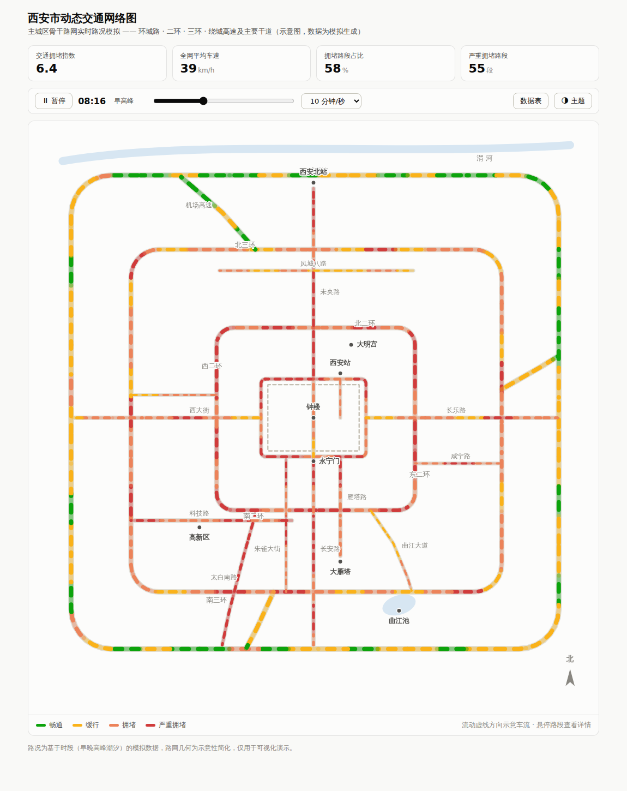

# kutato · 纯前端交互项目集

零依赖、无需构建、浏览器直接打开即可运行的交互式网页项目：

1. **西安市动态交通网络图**（`index.html`）—— 主城区路况动态可视化演示
2. **初中数学·原理实验室**（`math/index.html`）—— 从第一性原理出发的交互式数学学习工具，见 [math/README.md](math/README.md)

---

# 西安市动态交通网络图

一个纯前端、零依赖的西安市主城区交通路况动态可视化演示。单个 `index.html` 文件，直接用浏览器打开即可运行，无需构建或联网。



## 功能

- **示意路网**：环城路（明城墙）、二环、三环、绕城高速，以及未央路、长安路、东西大街、太白南路、科技路、雁塔路等主要干道，并标注钟楼、大雁塔、西安北站、高新区等地标。
- **动态路况模拟**：按一天 24 小时的时段模型（早高峰 ~8:15、晚高峰 ~18:20、午间小高峰、凌晨低谷）为每个路段生成拥堵指数，路段颜色实时变化。
- **车流动画**：沿道路流动的虚线示意车流，流速与该路段模拟车速挂钩——越拥堵流动越慢。
- **时间控制**：播放/暂停、24 小时时间轴拖动、播放速度切换（4/10/30 模拟分钟每秒）。
- **交互**：悬停任意路段查看道路名称、路况等级、平均车速与拥堵指数；顶部统计卡实时显示全网拥堵指数、平均车速、拥堵占比。
- **数据表视图**：可切换的表格按拥堵程度列出各条道路的当前状态（无障碍备用视图）。
- **浅色 / 深色主题**：跟随系统 `prefers-color-scheme`，也可手动切换。

## 路况配色

采用固定的四级状态色（配合文字图例，不单靠颜色传达信息）：

| 等级 | 颜色 |
|---|---|
| 畅通 | `#0ca30c` |
| 缓行 | `#fab219` |
| 拥堵 | `#ec835a` |
| 严重拥堵 | `#d03b3b` |

## 说明

路网几何为示意性简化（非精确地理坐标），路况数据由时段模型 + 噪声模拟生成，仅用于可视化演示，不代表真实交通状况。

## 运行

```bash
# 任选其一
open index.html                 # macOS
xdg-open index.html             # Linux
python3 -m http.server 8000     # 或起个静态服务器访问 http://localhost:8000
```
