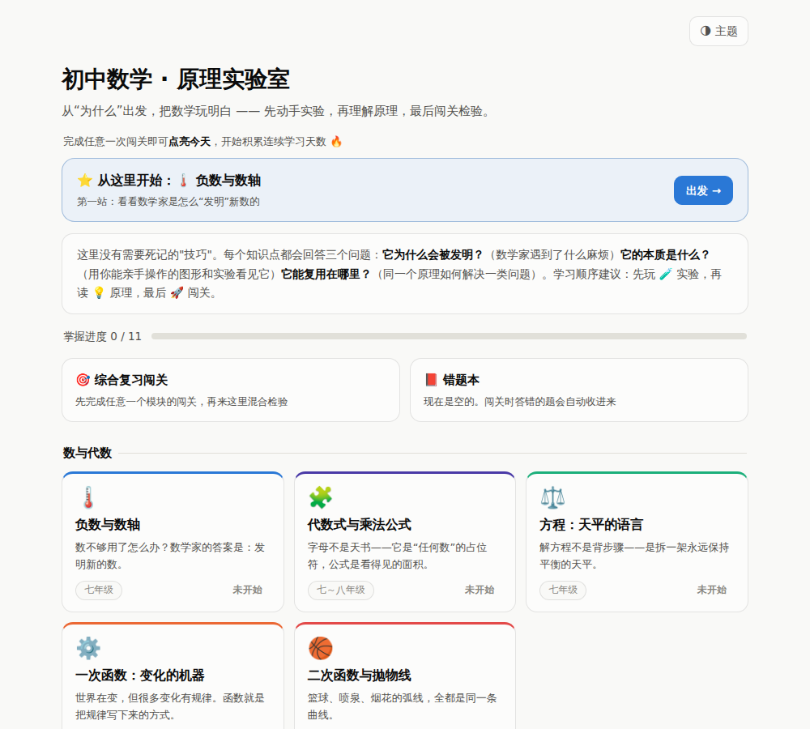

# 初中数学 · 原理实验室

一个给孩子的交互式数学学习网页。零依赖、可离线使用：用浏览器打开 `math/index.html` 即可，学习进度自动保存在本机浏览器（localStorage）。

## 设计理念：第一性原理，而非应试技巧

每个知识点都回答三个问题：

1. **它为什么会被发明？** —— 数学家当年遇到了什么麻烦（好奇心引入）
2. **它的本质是什么？** —— 用可亲手操作的图形和实验"看见"原理
3. **它能复用在哪里？** —— 同一个原理如何解决一类问题，长期受益

每个模块的学习闭环：🤔 先想一想（好奇心钩子）→ 💡 原理（讲清"为什么"）→ 🧪 动手实验（交互探究）→ 🚀 闯关检测（答对 80% 即为掌握，答错会解释原理而不只给答案）。

## 知识模块（覆盖初中三年主线）

| 领域 | 模块 | 核心实验 |
|---|---|---|
| 数与代数 | 负数与数轴 | 数轴移动游戏：加法是移动，减法是反向移动 |
| 数与代数 | 代数式与乘法公式 | 面积拼图：亲眼看到 (a+b)² 的四块、平方差的"切一刀拼过去" |
| 数与代数 | 方程：天平的语言 | 交互天平：两边同时操作解方程，理解"移项变号"的本质 |
| 数与代数 | 一次函数 | k/b 旋钮 + 函数机器；手机套餐比价（交点=方程的解） |
| 数与代数 | 二次函数与抛物线 | 顶点式三旋钮；投篮小游戏（让轨迹穿过篮筐） |
| 图形与几何 | 三角形与平行线 | 拖顶点看内角和恒为 180°；开关"平行线证明"亲眼看角被搬运；多边形切三角形 |
| 图形与几何 | 勾股定理 | 三边上的正方形；四个三角形重排——亲手完成面积证明 |
| 图形与几何 | 相似 | 放大三角形看 k 与 k²；重演泰勒斯用影子量金字塔 |
| 图形与几何 | 圆与 π | 内接多边形逼近 π（重走祖冲之的路）；圆周角定理探索 |
| 统计与概率 | 统计：平均数说了算吗 | "富翁搬进小区"：亲眼看平均数被极端值拖走而中位数纹丝不动 |
| 统计与概率 | 概率 | 抛一万次硬币亲眼看大数定律；两个骰子的"秘密形状" |

## 功能

- **“下一步”智能入口**：首页顶部一张卡片告诉孩子现在最该做什么（清错题 → 该复习的 → 继续上次 → 下一个新知识点），一键直达，不用翻列表。
- **连续学习天数**：完成任意一次闯关即"点亮今天"，🔥 连续天数温和地养成习惯。
- **闯关结算引导**：通关 → "下一个知识点 →"无缝衔接；未通过 → 一键滚回实验区；答错的反馈里直接给"去实验区"锚点，引导回原理而非硬记。
- **学习报告（家长页）**：`#/report` 一页看全掌握地图、各模块成绩/次数/最近学习时间、错题分布，附具体行动建议。
- **进度追踪**：每个模块记录最好成绩与掌握状态（≥80% 打勾），首页显示总进度。
- **测验引擎**：选择题 + 填空题（支持分数输入如 `1/6`），题目与选项每次乱序；答错时给出"为什么"而非只给答案；连对有火焰激励，通关撒花庆祝。
- **错题本**：答错的题自动收集（记录错误次数），专门页面"清错挑战"重练，答对即划掉——错题清零是比满分更扎实的掌握信号。
- **综合复习闯关**：从学过的模块随机混合抽题（交叉练习/interleaving）——大脑每题都要先判断"这是哪类问题"，比单元内刷题更防遗忘，也更接近考试与真实场景。
- **间隔复习提醒**：掌握超过 7 天的模块自动提示"该复习了"（遗忘曲线），综合闯关通过后重置计时。
- **浅色/深色主题**：跟随系统，可手动切换；所有画布实验随主题重绘。
- **离线可用**：无任何外部请求，手机/平板/电脑均可本地使用（已适配窄屏；触屏设备自动加大点按区域，输入框不触发 iOS 缩放；答对轻弹、答错轻晃的微动画反馈）。

## 给家长的使用建议

- 建议顺序：先让孩子**玩实验**，再读原理，最后闯关。
- 孩子答错时，先陪 TA 回到实验区"玩"，而不是直接讲答案——每道题的解释都指回对应的原理。
- 每个模块 15–25 分钟，适合一次学一个。

## 扩展新模块

在 `math/modules/` 下新建 `<id>.js`，调用 `MathLab.register({...})` 注册（参考任一现有模块的结构：`hook` / `sections`（concept + lab）/ `quiz`），并在 `math/index.html` 底部添加对应 `<script src>`。
